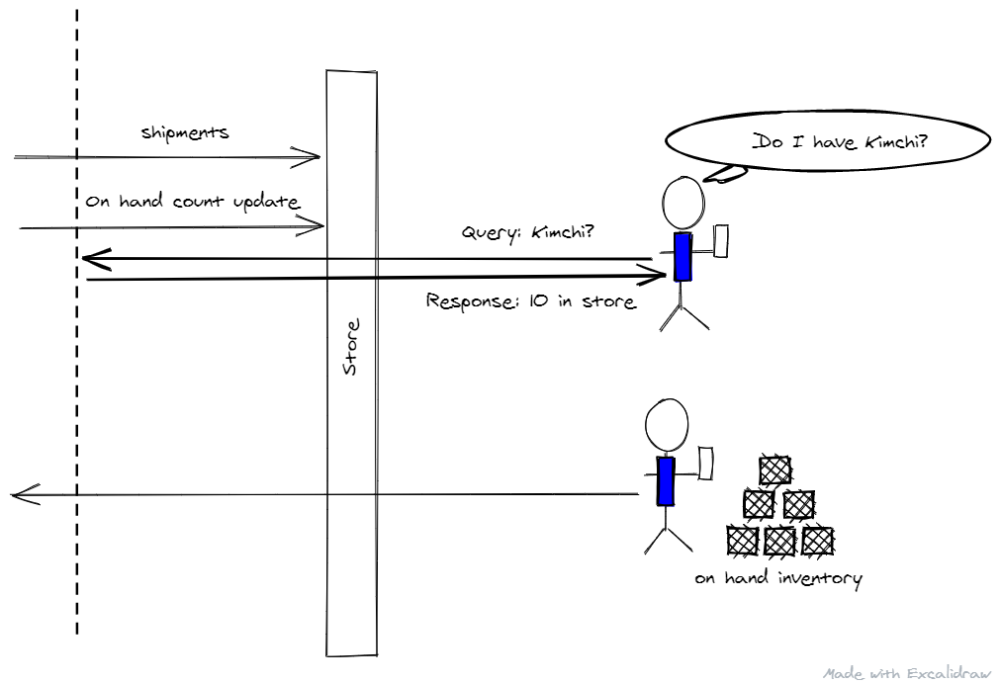

# Open Hack for Durable Entities using C\#

## Introduction

The objective of this repository is to provide its user with a set of challenges which will help them learn about Azure Functions Durable Entities.

## Durable Functions

Durable Functions are extensions of Azure Functions that let you build services with maintain state with in a serverless compute environment.

This helps us address business scenarios which may require processing to be spread over time due to need for certain data that may arrive at different intervals.

## Use case for this Open Hack

The use case for this Open Hack is inspired by a real life business scenario that occurs regularly at the stores. The business requirements however have been scoped to a solution that can be developed with the time bounds of the Open Hack.

Associates in the store require an accurate and frequently updated view of the inventory in the store as the on hand counts and shipments come in.

A independent On Hand count and Shipment feed into a central database via different systems. The objective to process and update the view for the associate in the store.

## Open Hack Methodology

To complete the open hack, the participant will have to go through a series of challenges. The challenges are:

1. Challenge 0: Set up and verify your development environment with Visual Studio Code, Azure Function Runtime tools, Azure CLI running in a DEV container.
2. Challenge 1: Deploy the master data store in Azure as Cosmos DB and hook up Change Feed processors using Azure Functions.
3. Challenge 2: Use change feed processor to communicate with Durable Entities representing each store.
4. Challenge 3: Final challenge, use the durable entities to update the Master Data Store.

## Prerequisites for the Open Hack

- Knowledge of a programming language - C#, Java, JavaScript or Python.
- Azure Subscription
- Microsoft Windows 10 or MacOS powered Workstation with:
  - [Docker Desktop for Windows/MacOS](https://www.docker.com/products/docker-desktop)
  - [Visual Studio Code](https://code.visualstudio.com/)
  - [Visual Studio Code - Remote Development Extension Pack](https://marketplace.visualstudio.com/items?itemName=ms-vscode-remote.vscode-remote-extensionpack)
  - [Azure Storage Explorer](https://azure.microsoft.com/en-us/features/storage-explorer/)

## Reviewing the Solution Design

Let's start by reviewing the **solution design** for the use case using virtual actors implemented as using Azure Functions Durable Entities. Click [here](docs/solution-design.md) to navigate to the solution design document.
