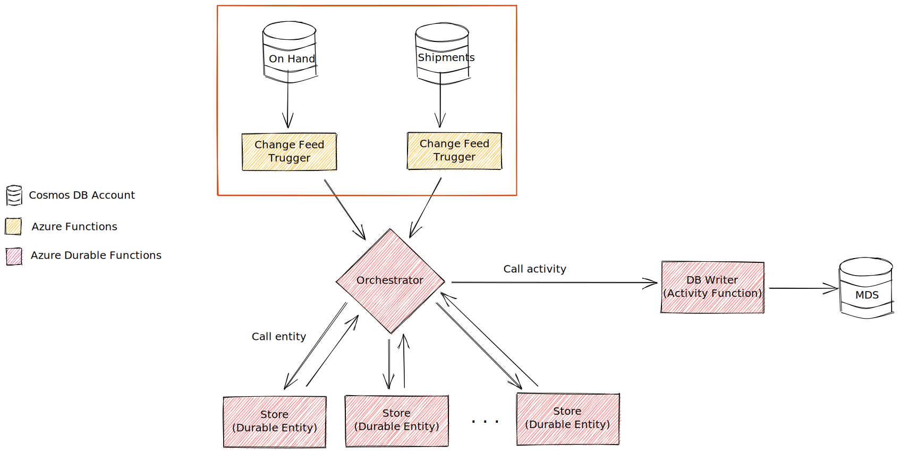

# Challenge 1: Connect Azure Functions as Change Feed Listeners for Azure Cosmos DB Containers

## Challenge Objective

**Congratulations!**

You have just completed setting up your development environment and ready to put together the first part of the solution.

As you read in the [solution design document](./solution-design.md), we process two key types of inventory data for a given store - On Hand and Shipments. These are stored in Cosmos DB database on Azure, in different containers. As data arrives in these containers, we being processing data for aggregating inventory in the store.

The challenge objective is to invoke the processing, when the data arrives in the collection.

## Guidance

As part of this challenge we are focusing on the following red outlined area of the design.

To accomplish this challenge, you will have to connect to your Azure Account and create a new Azure Cosmos DB Account and database called - `inventory` using the **SQL API**.

In the Cosmos DB database, create three containers:

- `shipments` (partition key: `/id`) : container for shipment documents.
- `onHand` (partition key: `/id`) : container for On Hand documents.
- `mds` (partition key: `/id`): master data store (MDS) container representing the inventory for all stores and all items.

Find a way to observe the changes in the Cosmos DB container and invoke the processing using Azure Functions. The Azure function should log the number of changed documents received and id of the first document.

## References

- [Azure Cosmos DB](https://azure.microsoft.com/en-us/free/cosmos-db/)
- [Creating collection in Cosmos DB](https://docs.microsoft.com/en-us/azure/cosmos-db/how-to-create-container)
- [Azure Cosmos DB - Change Feeds](https://docs.microsoft.com/en-us/azure/cosmos-db/change-feed)
- [Azure Functions](https://azure.microsoft.com/en-us/services/functions/)
- [Azure Functions Triggers and Bindings](https://docs.microsoft.com/en-us/azure/azure-functions/functions-triggers-bindings)
- [Azure Functions - Cosmos DB Change Feed Trigger](https://docs.microsoft.com/en-us/azure/azure-functions/functions-create-cosmos-db-triggered-function)
- [C# Azure Functions - GitHub Samples](https://github.com/Azure-Samples/functions-docs-csharp)

### Terminology

- **Azure Cosmos DB Change Feed**: A change feed in AzureDB Cosmos DB is a list of documents that have been updated or inserted.

## Challenge Completion Criteria

To successfully, complete this challenge, we should have:

- [ ] Created a Azure Cosmos DB database named - `inventory`.
- [ ] The Database should have three containers - `onHand`, `shipments` and `mds`.
- [ ] There should a way to detect inserts and updates to the `onHand` and `shipments` containers.
- [ ] The processing of the events should show the number of changed documents and id of the first document for each collection.

## Next Steps

Now we have Cosmos DB change feed rolling into Azure Functions, let's do something more **exciting** with the data in our next challenge.

Proceed to **[Challenge 2](challenge-002.md).**
