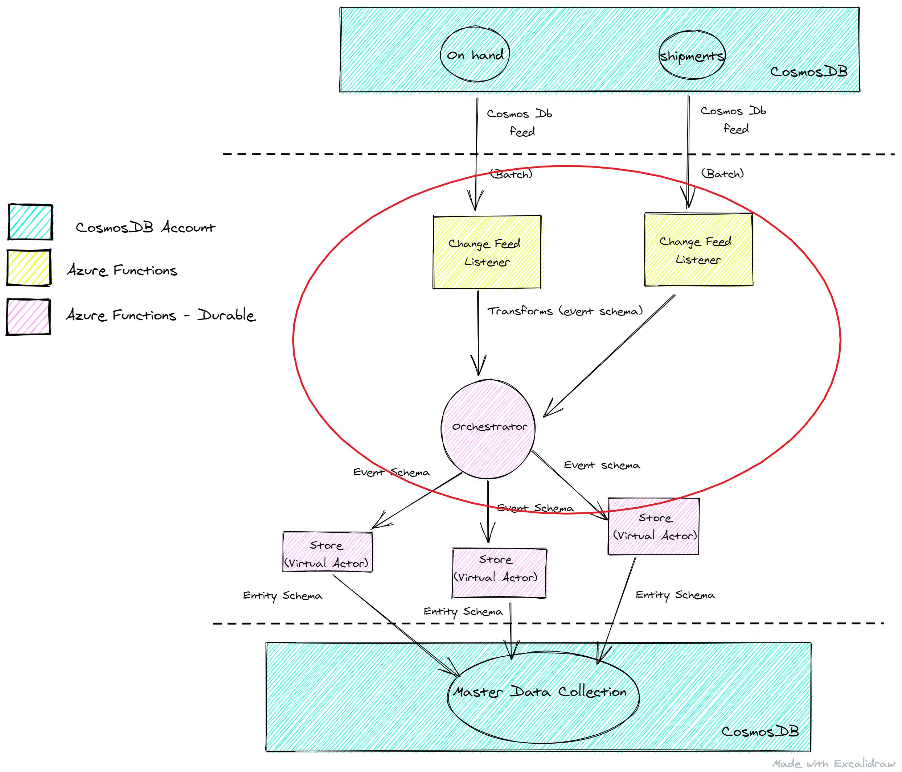

# Challenge 2: Invoke a durable entity per store to receive item related messages

## Challenge Objective
In Challenge 1 you set up listeners to detect inserts and updates to the onHand and shipments containers.

In this challenge, we'll send the change feed events to a data manager that maintains its own state and sends them to durable store entities.

## Guidance

### Background 
- Items are added to the Cosmos DB inventory database in two ways: `onHand` updates and `shipments`, each represented by a change feed listener Azure function.

    - `onHand` updates: represents an adjusted inventory count, say for example, due to an inventory assessment in a store.
    - `shipments`: represents a list of items added to inventory with UPCs and amounts, say for example, a truck delivery with pallets of different store products.

- The data is simulated by a Data Generator that sends json items to Cosmos DB in the format of the [message schemas](message-schema-definitions.md).

### Next Steps
- The data coming from the change feeds need to be transformed into an aggregation friendly schema that conforms to the [event schema sample](suggested-event-schemas.md).

- The new events need be sent to a new durable function which serves as an orchestrator. 

- The orchestrator then needs to partition and serve those events to individual virtual store entities.

- The events will be processed by the store durable entities to finally update the Master Data Store in Challenge 3.

- However, feel free to explore alternative architecture designs that differ from the suggested architecture flow.

## References

- [Durable Functions Overview](https://docs.microsoft.com/en-us/azure/azure-functions/durable/durable-functions-overview?tabs=csharp)
- [Entity Functions](https://docs.microsoft.com/en-us/azure/azure-functions/durable/durable-functions-entities?tabs=csharp)
- [Durable Functions Access Entities](https://docs.microsoft.com/en-us/azure/azure-functions/durable/durable-functions-entities?tabs=csharp#access-entities)
- [Durable Functions Signal Entities](https://docs.microsoft.com/en-us/azure/azure-functions/durable/durable-functions-http-api#signal-entity)

## Challenge Completion Criteria

- [ ] The listeners are updated to transform documents received from Cosmos DB into schema friendly events and send them to an orchestrator.
- [ ] The orchestrator partitions and sends events received from the listeners to new individual virtual store entities.
- [ ] Individual store entities are created and are receiving events. 
