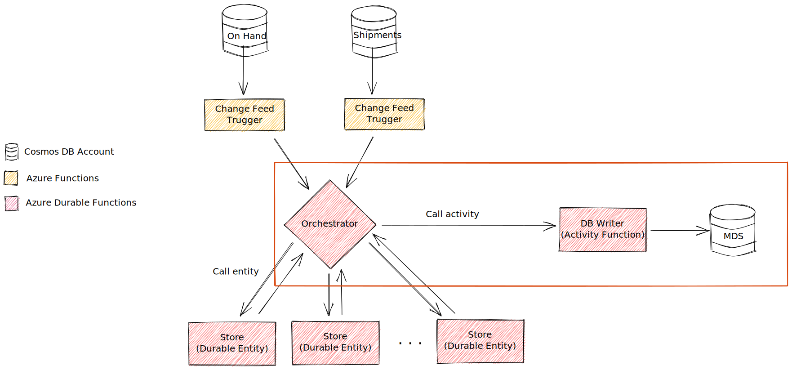

# Challenge 3: Add business logic to process the item messages

## Challenge Objective

For the last challenge, we want to write the aggregations from [Challenge 2](./challenge-002.md) into some "master data store" (MDS). Again, we'll use a Cosmos DB collection as the MDS. After each store entity is finished aggregating the result, each item's aggregation should be written as either a new document in the MDS (for the first time we see that item) or as an update to an existing document.

Ultimately, this MDS will be used to quickly retrieve aggregations via some sort of API (which is beyond the scope of this challenge). The objective is to make sure the MDS is kept up-to-date with accurate inventory data.

## Guidance

This challenge will focus on the red outlined area of the below design:

To accomplish this challenge, you will use the `MDS` container that you created in [Challenge 1](./challenge-001.md) to store inventory data that the orchestrator receives after calling an entity to perform some aggregation.

Also once the aggregation is validated, use the data generator to push some data into the on hand and shipment collections and verify the MDS is updated based on new data.

## References

- [Azure Cosmos DB .NET Client](https://docs.microsoft.com/en-us/dotnet/api/overview/azure/cosmosdb?view=azure-dotnet)
- [Azure Activity Functions](https://docs.microsoft.com/en-us/azure/azure-functions/durable/durable-functions-types-features-overview#activity-functions)
- [Orchestrator function code constraints](https://docs.microsoft.com/en-us/azure/azure-functions/durable/durable-functions-code-constraints) (don't write directly to Cosmos DB from the orchestrator!)
- [Accessing environment variables](https://docs.microsoft.com/en-us/sandbox/functions-recipes/environment-variables?tabs=csharp#accessing-environment-variables) in Azure Functions

## Challenge Completion Criteria

To successfully complete the challenge:

- [ ] Ensure that sending a "shipment" or "onHand" event writes the updated inventory data for the item in the MDS
- [ ] Ensure that the inventory data written is accurate
- [ ] Pump some shipment and on hand data using the Data Generator and see it being processed through to the MDS.
- [ ] ⚠️ Do not write directly to Cosmos DB in the orchestrator!
