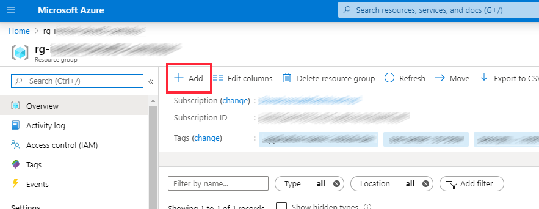
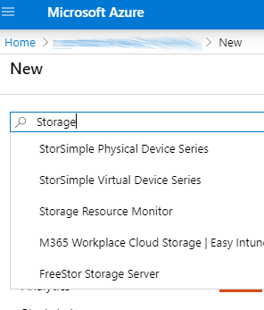
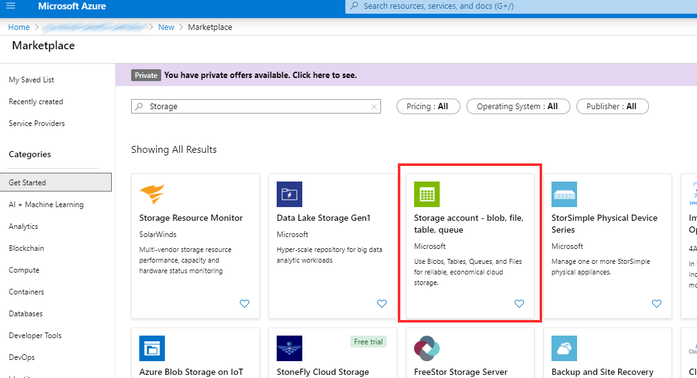
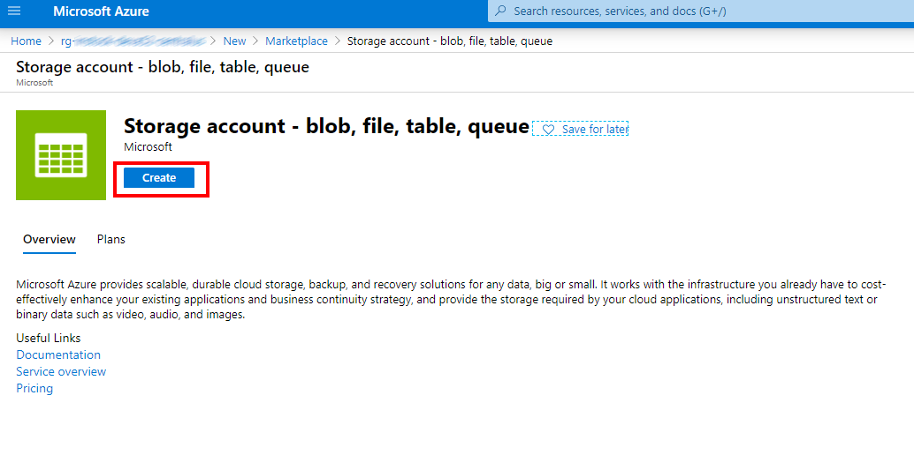
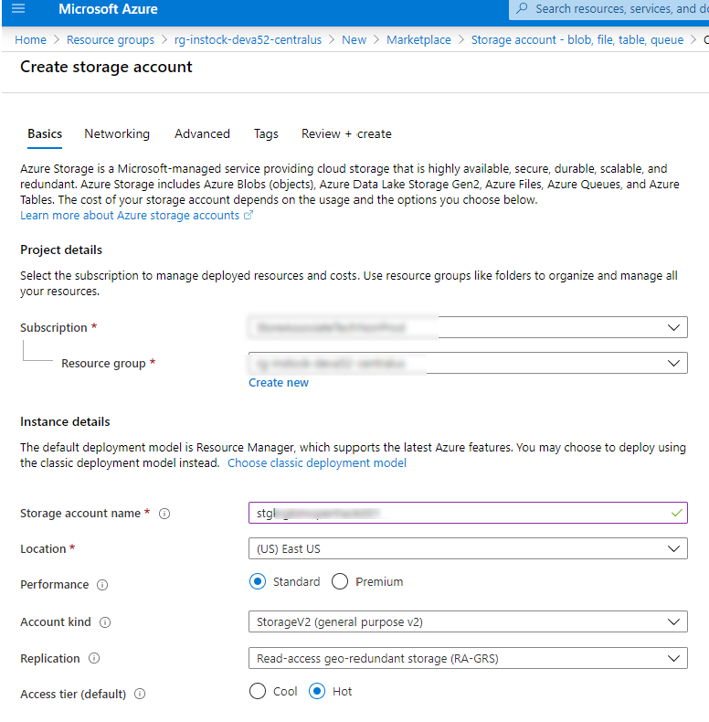
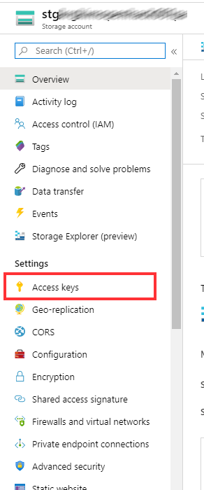
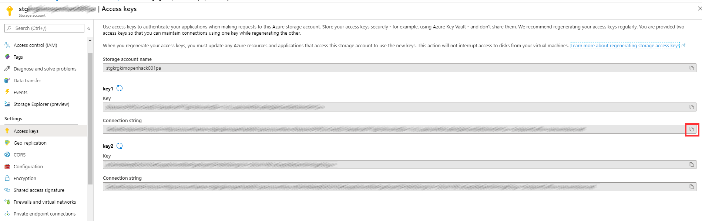

# Setting up Azure Storage for Azure Functions

[Return to root - README](../README.md)

## Introduction

This section of the documentation provides details on how to create a Azure Storage account and how to configure it with the local development environment for a backend store for Azure Functions.

Azure Functions Durable Entities uses Azure Table Storage for its backend state store. Unfortunately, we do not have cross platform emulator that effectively supports Table Storage, so for this one need, we will have to create an Azure Storage account to provide the backend storage.

## Creating the Azure Storage Account

1. Log on to the Azure Portal using your credentials.
2. Create a new resource group or Navigate to an existing resource group.
3. Click on the "+ Add" button to create a new resource in the Resource Group

   

4. This will take you to a screen with list of resources that can be added, with a search bar on top.
5. Type in "Storage" in the search bar and press "Enter".

    

6. This will give you a list of Storage options that you can create.
7. Select the "Storage Account - blob, file, table, queue" option.

   

8. This will take to page describing the Azure Storage Details. Click on the "Create" button on the page.

    

9. This will navigate you to a screen which prompts you for information about the storage account.
10. Enter a valid name for a storage account (all lowercase, 28 characters long, only alphabets or numbers).
11. Select "East US" as the location.
12. Select "Standard" for Performance
13. Select "Storage V2 (general purpose V2) as Account Kind.
14. Select "Locally-redundant storage (LRS)" as Replication (Since we are using it for development purpose only).
15. Select "Hot" as the Access tier (default).

    

16. Click on "Review + create" button, to validate the values entered.

    

17. After validation is performed, the "Create" buttons is enabled at the bottom of the screen.
18. Click on the "Create" button to start deployment.
19. Once the deployment is complete, navigate to the storage account.
20. On the left panel for Storage Account, click on "Access Keys".
21. This will open up the screens showing the access keys and connection strings on the right panel.

    

22. Click on button with the Copy to clip board icon for one of the connections strings.

    

23. Store the connections string safely. DO NOT SHARE via unsecured media, as it contains secrets that allows access to the contents of the storage account.
24. We will use the connection string in the next section below.

## Update local settings

1. In the root of the starter folder, create a new document called - local.settings.json
2. This is the configuration file for the Azure Function Runtime for local execution of the Azure Function code.
3. Put the following content in the file -

    ```json
    {
    "IsEncrypted": false,
    "Values": {
        "AzureWebJobsStorage": "UseDevelopmentStorage=true",
        "FUNCTIONS_WORKER_RUNTIME": "dotnet"
    }
    }
    ```

4. **IMPORTANT**: Replace the value for `AzureWebJobStorage` with the connection string, obtained in the previous section.
5. The final version of the JSON file should look something like this:

    ```json
    {
    "IsEncrypted": false,
    "Values": {
        "AzureWebJobsStorage": "DefaultEndpointsProtocol=https;AccountName=(accountnamehere);AccountKey=(supersecretlonkeyhere);EndpointSuffix=core.windows.net",
        "FUNCTIONS_WORKER_RUNTIME": "dotnet"
    }
    }
    ```

6. Now, the Azure functions will use the Azure storage as it backend data store.

## Resources

- [Azure Functions Core Tools](https://docs.microsoft.com/en-us/azure/azure-functions/functions-run-local?tabs=windows%2Ccsharp%2Cbash)

## Next Steps

Now that you have configured Azure Storage and Azure Functions to use it, we can proceed to running a debugging the code

Proceed to [Step 3](./azurefunctions-running-debugging.md), to start running and debugging the Azure Functions in your container. Alternatively, return to [main README document](../README.md) or review [Step 1](./vscode-remote-development.md), setting up remote development environment using VS Code and Docker containers.
