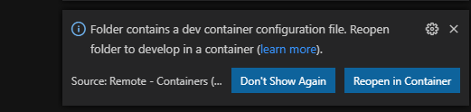
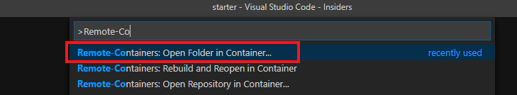
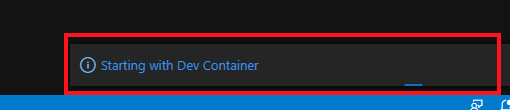
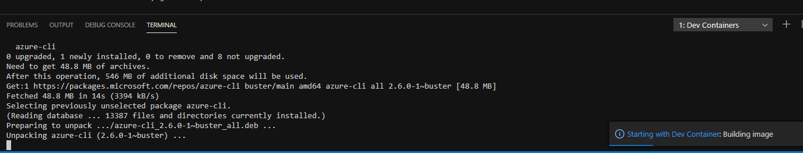
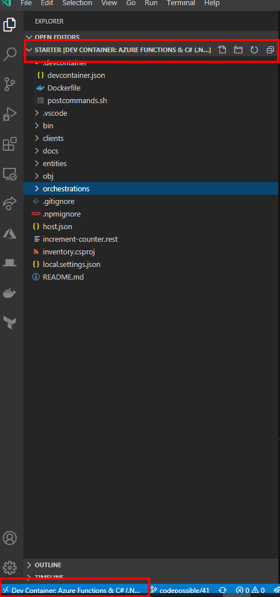
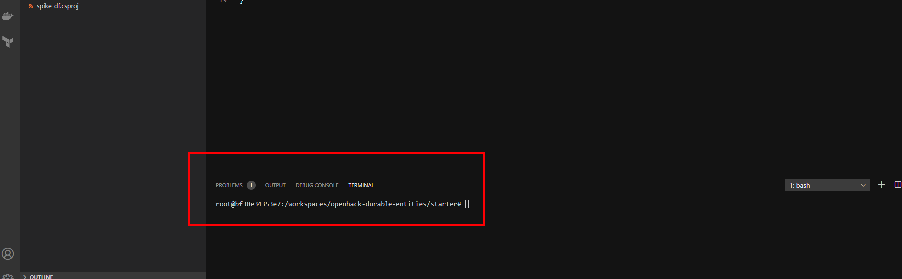

# Starting Visual Studio Code - Remote Development

[Return to root - README](../README.md)

## Introduction

This section of the documentation provides detailed steps to follow for setting up a Remote Development environment using Docker Container for the starter project project.

## Steps

1. Clone the Github repository using `git clone https://github.com/cse-southeast-devcrew/openhack-durable-entities.git` command
2. Launch Visual Studio Code
3. Click on File > Open Folder... option.
4. In the File Open dialog window, navigate to the `starter` folder on your local filesystem where you cloned the repository.
5. Click on "Ok" in the File Open Dialog
6. Visual Studio Code will open the folder, if the Remote Development Pack is installed and enabled, it will detected the `.devcontainer/` sub folder.
7. On the right bottom side of the screen, you will a prompt to open the folder in a container.

    

8. Click on "Reopen in container" button, to start the Docker container build (for the first time) or to start the Docker container.
9. If you miss the prompt as it is available for the short time, open the VS Code command pallet (using Ctrl+P on Windows/Cmd+P on Mac) and type "Remote-Containers", which will give you the option to "Open folder in container...". Select that option and select the `starter` folder again and continue with the following steps.

    

10. This will close the current instance of VS Code and Open a new instance of VS Code.
11. As VS Code start, on the bottom right hand side, a dialog will popup, saying "Starting with Dev Container".

    

12. Click on the text to view progress on the Docker container start/build.
13. Now, you should be able to to see the activities on the "Output" window on the progress of building/start of the Docker container.

      

14. Once the Docker container is built and started, the Explorer panel on left side, should fill up with contents of the starter code.

      

15. The text bordered in red, indicates that VS Code is now connected to the Docker Container to run the code.

16. Click on `Terminal` on the bottom panel to start an interactive terminal on the Docker Dev container

    

## Resources

- [Visual Studio Code Remote Development](https://code.visualstudio.com/docs/remote/remote-overview)
- [Remote Development with Containers](https://code.visualstudio.com/docs/remote/containers)

## Next Steps

Now that you have the development environment, we wil be spending more time here working on configuration and code here.

Proceed to [Step 2](./azurefunctions-storage-setup.md), creating a Azure Storage account to support the Azure Functions code. Alternatively, return to [main README document](../README.md).
